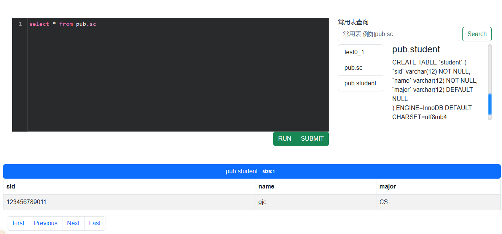

# 数据库课程设计

##### 杨业昶，管进程，陈正

## 1 概述

项目地址：https://github.com/yyc001/db-project

我们设计了一个数据库OJ系统，实现了数据库OJ系统的基本功能，包括题目提交验证、题目搜索、常用表查询等。然后优化和丰富了界面和额外功能，包括看板娘、评论区、用户信息界面等。

## 2 成员分工

### 2.1 杨业昶

后端开发+前端js

### 2.2 管进程

前端开发+美工

### 2.3 陈正

数据库设计

## 3 开发环境

数据库：MySQL

后端：Flask+jinja2

前端：bootstrap+jQuery UI+codemirror

## 4 功能

打开网站进入home页，然后进入login页，登陆后进入主页面，可以进行题目选择

### 4.1 OJ基本功能

#### 4.1.1 数据库设计

考虑需要用户执行任意的 SQL 语句，所以为每个用户建立一个 SQL user 和 database。

此外有用于存放答案的 `answer` database，用户可读的 `pub` database 以及用于管理的 `manage` database。

在 `manage` database 中，`record` 表存放用户提交题目的记录，`saved_query` 存放用户上一次查询的 SQL 语句，`test_table` 存放每道题目，包括题目名称、描述、分值等。

#### 4.1.2 SQL 代码执行

在黑色代码输入框中输入单条 SQL 语句，支持代码高亮和自动补全。

点击 `RUN` 执行 SQL 语句，在上方 alert 框中显示执行成功与否，下方显示查询结果。

在同一次请求中，可能存在用户权限执行 SQL 语句和管理员权限执行 SQL 语句两种操作，所以后端线程创建会两个数据库连接分别执行。

用户权限执行的 SQL 语句会记录在 `saved_query` 中，以供未来可能的翻页查询。

#### 4.1.3 结果验证

点击 `SUBMIT` 按钮提交本题，在上方 alert 框中显示提交情况。

结果验证采用全表比较的方式，用户库中的答案与 `answer` 库中的标准答案进行比较，忽略数据类型。

#### 4.1.4 题目搜索

题目搜索使用 jQuery ajax 向后端发送请求指定的题目 id，找到返回成功信息并跳转，失败返回失败信息。

#### 4.1.5 常用表查询展示(支持翻页)

点击一个常用表，右侧显示该表结构描述语句，下方显示表内容，并支持翻页。

翻页实际操作为再次执行上次查询的 SQL 语句，返回指定行到指定行的结果。

#### 4.1.6 提交记录展示

显示上一次提交记录

#### 4.1.7 题目得分统计

右侧显示题目要求和本题得分，左上角为显示总分和得分的进度条。

### 4.2 额外功能

#### 4.2.1 看板娘

看板娘一词源自日语“看板娘(かんばんむすめ)”。其中的“看板”指的是店面招牌，或者是为了宣传、打广告而制作的宣传牌。“看板娘”也就是店面的招牌姑娘，亦即能够提升店面人气和顾客流量的女服务生、女店员等。也就是说，看板娘本身就是一块“活看板”，其本身的魅力就能够起到宣传、拉人气的作用。英语又称之为“Poster Girl”。

#### 4.2.2 评论区

使用基于LeanCloud的快速、简介高效的无后端评论系统。

- 快速

- 安全

- Emoji 

- 无后端实现

- MarkDown 全语法支持

- 轻量易用

  

#### 4.2.3 展示页

使用固定导航栏+首页大图+下拉滑动显示关于系统的详细信息

具体内容：

进入包括首页大图和LOGIN按钮和开始按钮

ABOUT 关于我们的数据库OJ的基本信息

OVERVIEW 数据库OJ系统基本外观

TEAM 我们的团队

TIME 项目花费时间

WORK 我们的内容展示

STATISTIC 代码统计

BACK TOP 回到顶部

#### 4.2.4 用户页

用户页包括头像+基本信息+补充信息

通过返回按钮返回题目页

#### 4.2.5 明暗模式

使用bootstrap 5 的 主题接口设置默认明暗模式，利用Jquery click事件实现明暗模式切换

#### 4.2.6 代码区(多功能)

代码区使用codeMirror，CodeMirror 是 Web 的代码编辑器组件。它可以在网站中用于实现一个支持多种编辑功能的文本输入字段，并且具有丰富的编程接口以允许进一步扩展。

我们在代码区中支持了：

- 代码高亮

- 代码补全

- 代码行号

- 括号匹配

  

#### 4.2.7 返回顶部

利用jQuery的scroll事件和click事件实现了返回顶部按钮动态出现和点击返回顶部功能

## 5 总结

通过数据库OJ设计，了解学习了关于数据库的知识，掌握了网页开发的技术

